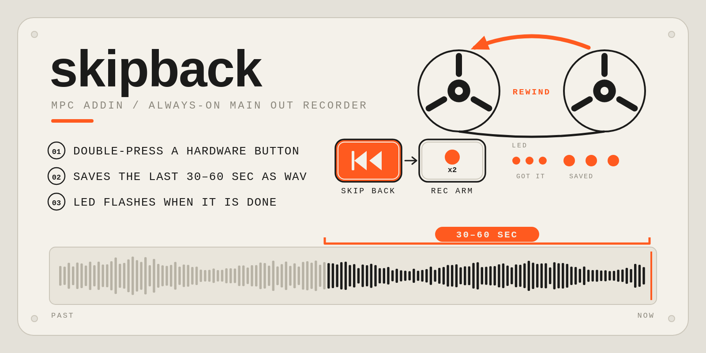

# MPC Skipback



**Record the past.** Skipback listens to your MPC's main output all the time. When you double-press a button, it
saves the **last 30 to 60 seconds** as a WAV file, so the idea you had a moment ago is already on the card.

An addin for Akai MPC OS standalone devices (MPC Live, One, X, Key and Force). It runs inside MPC, with no extra
program to start, and uses the controller's own buttons and LEDs. Tested on a Force; see
[Status](#status).

## Features

- **Always recording, nothing to arm.** A rolling buffer holds the newest audio. Nothing is written to disk until you
  save.
- **One gesture to save.** Double-press a hardware button: Rec Arm on a Force, Overdub on other MPC models, or any
  button you pick (`button=learn` lets you just press it). The first press still reaches MPC as usual.
- **Light feedback (Force).** The button's LED gives three quick flashes when the double press registers and three slow
  ones when the WAV has been written.
- **30 to 60 seconds**, your choice (`window_sec`), saved as a 24-bit stereo WAV with the date and time in its name.
- **Puts the file where you'd look for it.** Saves to a USB drive or SSD if one is plugged in, else the SD card, else
  your Samples folder. Or any folder you choose.
- **Triggerable by anything.** A script, plugin or other tool can start a save by creating a file, and finds out the
  result from another.
- **Light on the system.** The audio thread only copies samples (no locks, no allocation, no system calls); the save runs
  on its own thread. It does nothing in any program but MPC.

## Requirements

- An Akai MPC or Force running MPC OS (32-bit ARM; the installer checks).
- SSH access to the device as root, to install.
- The Force is the only model it has been tested on. Other models use a default button that has not been checked
  yet: see [Other models](#other-models-and-learn-mode).

## Install

1. Download `MPC-Skipback-<version>-mpc-armv7.zip` from the
   [Releases](https://github.com/sd88me/mpc-addin-skipback/releases) page and copy it to the device (for example
   `scp` to `/tmp`).
2. On the device, as root:

   ```sh
   cd /tmp && unzip MPC-Skipback-<version>-mpc-armv7.zip && cd MPC-Skipback-<version>
   sh install.sh
   ```

3. **Save your project first.** The installer adds the addin to MPC's `LD_PRELOAD` (keeping everything already in it)
   and **restarts MPC**, which closes the open project. `sh install.sh -n` installs without restarting; the addin starts
   at MPC's next start. The addin lives in `/data/mpc-addins/skipback/` on the internal storage.

Installing a newer version over an older one keeps your `skipback.conf`. You can also install it with the
[MPC Plugin Manager](https://github.com/poloq-instruments/mpc-vst-manager) or `mpc-store.sh` once it is in the
catalog. How the installer works, and what to do if an addin stops MPC from starting, is in the
[addin guide](https://github.com/sd88me/mpc-vst-plugins/blob/main/docs/ADDINS.md).

## Using it

### Saving

- **Double-press the button.** On a **Force**, press **Rec Arm** twice, within about a third of a second. On **other
  models** the default is **Overdub** (not yet checked on a device: see
  [Other models](#other-models-and-learn-mode)). The first press does what it always does (Rec Arm arms, Overdub
  toggles), MPC sees both presses, and the second one starts the save. Pick a button where a quick double press is
  harmless.
- **Or create the trigger file.** Anything that can create `/tmp/mpc-addin-skipback.trigger` starts a save:

  ```sh
  rm -f /tmp/mpc-addin-skipback.done
  touch /tmp/mpc-addin-skipback.trigger
  cat /tmp/mpc-addin-skipback.done        # a moment later
  ```

The addin deletes the trigger file when it takes it, so two presses are two saves. It saves what played *before* the
trigger, up to `window_sec` seconds; right after MPC starts there may be less than the full window.

### The LED (Force)

The LED feedback is on by default only on a Force, the one model its protocol is known for. Elsewhere there is no LED
feedback unless you set `led=1`; check the saved file or `skipback.log` instead.

| You see | It means |
|---|---|
| three quick flashes | the double press registered; the save has started |
| three slow flashes | the WAV is written (usually 2 to 5 seconds later, depending on the card) |
| quick flashes only | the save failed; see the `error` line below |

After flashing, the LED goes back to whatever MPC had set it to.

### The result file

`/tmp/mpc-addin-skipback.done` holds one line after every save:

| Line | Meaning |
|---|---|
| `ok <path>` | saved; the path is the new WAV |
| `error <reason>` | nothing saved: no audio yet, disk full, folder not writable, drive removed |

To know a save finished, delete `done` first and wait for it to appear. `skipback.log` (in the addin folder) records
each save and where it went.

### Where the files go

Files are named `Skipback_YYYYMMDD_HHMMSS.wav` and go in a `Skipback` folder. With `output_dir=auto` (the default) the
addin picks, at save time, the first of these that exists and is writable:

1. **a USB drive or SSD**, as `<drive>/Skipback`, or inside the drive's own `Force`, `MPC` or `APC Documents/Samples`
   folder if it has one;
2. **an external SD card**, the same way;
3. **this device's own Samples folder**, found in MPC's settings (the browser shortcut that ends in `/Samples`, else
   the Samples folder beside a recent project's Projects folder, else a `Force`, `MPC` or `APC Documents/Samples` folder
   on the SD card, else `/data/Skipback`).

Plugging in a drive moves new recordings there; unplugging it moves them back. `output_dir=samples` skips the drives.
An absolute path (`output_dir=/media/<drive>/Skipback`) is used as it is: if that drive is not mounted when you save, the
save fails with an `error` instead of going somewhere else. A 30-second WAV is about 8 MB.

### Settings

`/data/mpc-addins/skipback/skipback.conf`, one `key=value` per line, read **when MPC starts** (restart MPC after
editing). `etc/skipback.conf.example` in this repo lists every key with its explanation.

| Key | Default | What it does |
|---|---|---|
| `enabled` | `1` | `0` leaves the library loaded but idle |
| `window_sec` | `30` | seconds saved per trigger, 1 to 60 |
| `button` | `auto` | `auto` = 93 (Rec Arm) on a Force, 80 (Overdub) on other models; `learn` = the first button you double-press becomes the button (remembered in `button.learned`); a note number; or `0` for no button, leaving the trigger file |
| `double_ms` | `350` | two presses within this many milliseconds are a double press |
| `output_dir` | `auto` | `auto` (SSD, else SD card, else Samples folder), `samples` (Samples folder only) or an absolute path |
| `led` | `auto` | `auto` = on for a Force, off for other models; `1` forces it on, `0` off |
| `led_button` | `auto` | which LED blinks (a button number); `auto` = the same button |
| `led_fast_blinks`, `led_fast_ms` | `3`, `50` | the quick flashes: how many, and the length of each half in ms (`0` blinks = none) |
| `led_blinks`, `led_ms` | `3`, `250` | the slow flashes |
| `led_on` | `3` | the LED value of the lit half of a flash (the Force's Rec Arm shows 3 as lit) |
| `click` | `0` | `1` also plays a short click through main out when a save finishes (it is not recorded) |
| `trigger`, `done` | `/tmp/mpc-addin-skipback.{trigger,done}` | the two marker files |
| `left`, `right` | `0`, `1` | channels of MPC's output stream that carry main out |
| `tap_card` | `auto` | the codec's ALSA card |
| `poll_ms` | `100` | how often the trigger file is looked for |
| `midi_log` | `0` | `1` logs controller presses and every LED change MPC makes, for finding button numbers and LED values on another model. It writes a lot; turn it off afterwards |
| `log` | `auto` | `skipback.log` in the addin folder; an absolute path, or empty for none |

### Other models and learn mode

The buttons are numbered by MPC per model, and only the Force's are checked here (Rec Arm is note 93, Rec 73). On any
other model the default is **Overdub (note 80)**, from the shared MPC button tables, which is a guess. **Please help
find out what works on yours.** There are two ways:

**1. Learn mode (easiest).** Lets you pick any button without knowing its number.

1. Edit `/data/mpc-addins/skipback/skipback.conf` on the device and set `button=learn`.
2. Restart MPC (`systemctl restart acvs`, or power-cycle) and play something so the audio starts.
3. **Double-press the button you want to use** (twice, quickly). You hear a short click: it is learned and remembered in
   `/data/mpc-addins/skipback/button.learned`. This press only teaches; it does not save.
4. Double-press it again: that saves a WAV into your `Skipback` folder.

Delete `button.learned` and restart to learn again. Leave `button=learn` in place; it uses what was learned.

**2. Read the numbers yourself.** Set `midi_log=1`, restart, press the button you want and read
`/data/mpc-addins/skipback/skipback.log`: a press shows as `controller in: 90 <note> 7F` (the note is in hex: `50` is 80).
Set `button=<that note, in decimal>`. Set `midi_log=0` again, because it logs a lot.

**What to report** (an issue on this repo, or the MPC Discord thread): your model and MPC version; which button
you found and whether it worked; the `skipback.log` lines that start `controller input hooked` (they name the port, which
is how the model is recognised) and `playback:` (the audio format); whether the WAV sounds right (silent or one-sided
means main out is not channels 0/1: try `left`/`right`); and, if you set `led=1`, whether the button's LED reacted. With
that I can make the right default for each model.

If there is no suitable button, set `button=0` and use the trigger file (for example from a button remap tool).

### Turning it off or removing it

- `enabled=0` in `skipback.conf` (and restart MPC) leaves it loaded but idle.
- `sh /data/mpc-addins/skipback/uninstall.sh` removes it. It also deletes `skipback.conf`; your recordings are kept.

## Troubleshooting

- **Nothing happens on a double press.** Open `/data/mpc-addins/skipback/skipback.log`. It should show `active`, then
  `controller input hooked` and `playback: ... Hz`. If it says `button N` check that N is the button you are pressing (or
  use `button=learn`). No `controller input hooked` line means the button logic could not find
  the controller port (use the trigger file meanwhile). If `button 93 pressed twice` appears but nothing is saved, the
  next lines say why.
- **`error no audio yet`.** MPC has not opened its output since it started; play something, then try again.
- **The WAV is silent or one-sided.** Main out may not be channels 0/1 on your model: try other `left`/`right` pairs.
- **It saved somewhere unexpected.** The log line for each save gives the folder, and which drive is picked is explained
  under [Where the files go](#where-the-files-go). Set `output_dir` to choose.
- **MPC won't start after installing.** SSH stays up. Run `sh /data/mpc-addins/skipback/uninstall.sh -y -n` with MPC stopped
  (`systemctl stop acvs`), then start it again; the addin guide has the full recovery steps.
- **With MockbaMod.** MockbaMod diverts the controller, so the button logic may not see presses; use the trigger file. The
  installer also notices an old MockbaMod `run_skipback.sh` add-on and says so: run only one of the two.

## Status

Works on an Akai Force (MPC 3.9.1, 2026-10-10): the double press, the saves (to the SD card, then to a USB drive), the
LED flashes and the settings were all used on a real device. The other models are untested: the default button there
(Overdub) is a guess and the LED feedback is off, because their button and LED numbers are not known yet. `button=learn`
is there to find them; see [Other models](#other-models-and-learn-mode). The offline tests (x86, ASan/UBSan, against a fake audio library and a fake MIDI
port) cover everything but the device itself.

Known limits:

- **Memory.** The rolling buffer is sized for the largest window at the highest sample rate and grows to about 48 MB of RAM
  over the first couple of minutes whatever `window_sec` is.
- **Second press.** The second press of the double press also reaches MPC, so a toggle button (Rec Arm, Overdub) toggles twice and ends where it started.
- **Slow cards.** A save takes 2 to 5 seconds on the Force's SD card; the LED waits for it. The audio is not affected.
- **Failed saves** show quick flashes only; the reason is in `done` and the log.
- **Project name and tempo** are not in the file name (the older Force-only version, in
  [force-audio-jack](https://github.com/sd88me/force-audio-jack), had them).

## How it works

- **Audio.** The addin hooks `snd_pcm_open`, `snd_pcm_hw_params`, `snd_pcm_writei` and `snd_pcm_writen` on the codec's
  playback stream, the technique of [mpc-addin-usb-audio](https://github.com/jacob-sabella/mpc-addin-usb-audio). Two
  channels of every block MPC plays are copied into a ring buffer. A short write is rewound, so a retried write never
  duplicates audio.
- **Button.** MPC reads the controller from a rawmidi port with "Private" in its name (note-on, channel 1). The addin hooks
  `snd_rawmidi_read` on it and only looks at the bytes; nothing is changed, so it works with or without a button remap
  tool such as [akai_standalone_remap](https://github.com/mmiroshnikov/akai_standalone_remap).
- **LED.** MPC sets a button LED by writing a control change on channel 1 to the same port (controller = button, value =
  state), only when it changes. The addin remembers the last value of each and, after a blink, writes that value back.
  (The format is described in TheKikGen's
  [MPCLiveXplore-libs](https://github.com/TheKikGen/MPCLiveXplore-libs).)
- **Save.** A separate thread copies the newest window out of the ring and writes the WAV to `.tmp`, then renames it. It
  starts at the first playback `hw_params`, not in the library constructor, because a thread started that early crashed MPC
  in a sister addin.

## Build and test

```sh
tools/test_host.sh       # x86, ASan + UBSan: unit tests, and the addin in front of a fake libasound / rawmidi
tools/build_armhf.sh     # Docker arm/v7: glibc <= 2.31, no libasound dependency, only the expected exports
tools/device_test.sh     # on the device: triggers a save the way a script would and prints the result
```

Package with `tools/release_addin.py` from [mpc-vst-plugins](https://github.com/sd88me/mpc-vst-plugins), then
`catalog_check.py --catalog`. The settings file, installer and release layout are described in that repo's `docs/ADDINS.md`.

## Credits

Built by [sd88me](https://github.com/sd88me). The in-process audio hook follows
[mpc-addin-usb-audio](https://github.com/jacob-sabella/mpc-addin-usb-audio) by Jacob Sabella; the Force's LED protocol
is from TheKikGen's [MPCLiveXplore-libs](https://github.com/TheKikGen/MPCLiveXplore-libs). The Skipback idea and the first
Force version come from [force-audio-jack](https://github.com/sd88me/force-audio-jack).

## License

MIT. See [LICENSE](LICENSE).
